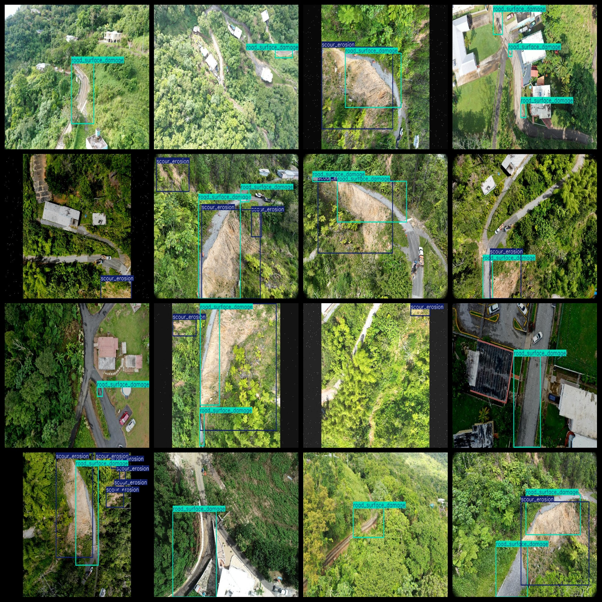

# UAV View Aerial Road Surface Damaged Detection Dataset 1282 imagesVOC+YOLO format

The UAV View Aerial Road Surface Damaged Detection Dataset consists of 1282 images in the VOC+YOLO format. The dataset is organized as follows:

- Images (JPG format): 1282
- Annotations (XML format): 1282
- Annotations (TXT format): 1282
- Number of categories: 6
- Repository: datasets_sl
- Annotation category names in the YOLO format are not consistent with the labels folder's classes.txt file, but rather based on the order in the "labels" folder.
- Label translation: Bridge damage, Culvert damage, Debris obstruction, Road surface damage, Scour erosion, Shoulder failure

For each category, the number of bounding boxes is as follows:

- Bridge damage: 19
- Culvert damage: 23
- Debris obstruction: 1
- Road surface damage: 1928
- Scour erosion: 721
- Shoulder failure: 190
- Total bounding boxes: 2882

The number of images per category is as follows:

- Bridge damage: 16
- Culvert damage: 22
- Debris obstruction: 1
- Road surface damage: 1212
- Scour erosion: 423
- Shoulder failure: 139

The images have various resolutions, such as 640x426, 640x479, etc.

The data was labeled using the labelImg tool. There is no enhancement to the dataset.

Note that this dataset does not include partitioned training, validation, or test sets; users must manually divide it.

It should be noted that this dataset does not guarantee any accuracy for models trained on it or any weights files.

The following are the annotations and images:

## Images

---

Here is a pay link on Stripe (https://buy.stripe.com/3cs8yP7sY87d0vu9AB). Please contact me lonlonago@foxmail.com after funding $89, and I will send you a complete data files, thank you!

